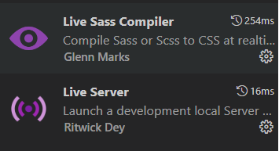

# bootstrap-exercise

IMPORTANT HAVE NODEJS AND NPM INSTALLED TO RUN THIS PROYECT SEE NODE DOC: (https://nodejs.org/en/docs/guides)


This project is a brief example of how we can use bootstrap making a simple form to save user data in local storage, and after that, show in the other display page called users.

## How to start

To be able to view the result after cloning the repo is necessary to install and run some commands in order to compile the project

First of all we must install the following extensions:
-Live Sass Compiler
-Live Server


After that we will open a terminal in source code and we will run the following command:

```bash
  npm install
```

Once all dependencies are in our projects(node_modules folder), we will execute live server


## Authors

- [@dondifer](https://www.github.com/dondifer)

## Links info

Here is a link of Boostrap presentation: (https://docs.google.com/presentation/d/1vCL0S2otQ6OHfa4uBYSlDjevz-GCP7lvu14lBlvtUn4/edit?usp=sharing)
